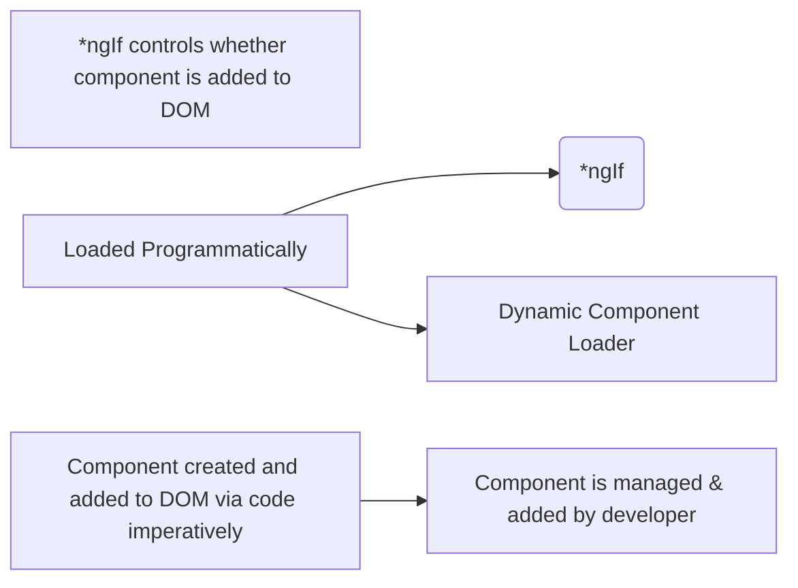

# Recipe project

## Introduction

Hi I am Siyi Li and I’m a Front-end Developer, working mainly on web development. I started learning front-end 2 years ago. Working with websites aroused my curiosity in how they were built and how all the parts worked together behind the scenes. I got my master degree on Computer Science from University of Rhode Island. I am skilled at HTML5, CSS3, JavaScript, Angular ,Django including backend development with Express.js, Node.js and SQL. 

I just graduate from URI on December 2020 and my major is computer science. I started learning front-end 2 years ago. In the past two years, I have did some projects on database design and building website by using Django framework.  I start to work with Javascript three month ago and build some demo web application by following some online tutorials and also 


I have built some very good web design projects. One of them is a Shopping cart website build with Angular11 to help people buying furnitures online. It is a single page application. It provides users with many ideas of room design on the website.  When user clicks the image or the title of any ideas, the details of the idea will appear on the right half of the screen. This idea id  will pass by using url parameters. Since user can access the detail page by directly typing the url, I build a **resolver** to guard our route. In the resolver, it will check if data the route depends on is there. If not, it will call the fetchdata function from our http service.

In the detail component, there are lots of data and a set of furnitures used as decoration in the sample room. I create a **reactive form** to display data and use **FormArray** to manage the funiture array.  If the user like any furniture, they can add these furniture into their shopping cart by clicking a button. This is implement by service using a subject. 


npm run json-server


I setup a **Subject** in service, to detect any change on the shopping-list array, and subscribe in shopping cart component. So whenever any furniture is pushed into shopping-list, the updated shopping-list will display on the shopping cart page.

We also allow user to edit their ideas. In the template of the edit component, I create a **reactive form** to display post data and use **FormArray** to manage the funiture array. User can create, delete or modify these data. 

 In this application, it has two main feature modules, ideas module and shopping cart module.

 I register the idea id with the URL in the router module and the id will be passed as **Router parameters** to the detail component when I call the navigate() funtion. Then the detail component can access the data by calling method from the service and passing ID as parameter.


I chose reactive form instead of template-driven form because the form can be a large-scale form and reactive form is more flexible and scalable. We may add more informations like installation time to the post data and the dataset can be huge. The fact that reactive form is synchronous makes scaling easier. One property of our post data is an furniture array and we want to manage it dynamically so we use **FormArray**. The removeAt() function makes deletion very easy to implement.


## What Angular is?

Angular is a JS framework to allow you to create single page web applications(SPAs). Angular is a development platform, built on [TypeScript](https://www.typescriptlang.org/). As a platform, Angular includes:

1. **A component-based framework** for building scalable web applications

2. **A collection of well-integrated libraries** that cover a wide variety of features, including routing, forms management, client-server communication, and more

3. A suite of developer tools to help you develop, build, test, and update your code

   

Angular **extends HTML with additional syntax** that lets you insert dynamic values from your component. Angular **automatically updates the rendered DOM** when your component’s state changes. 

Angular also supports **property bindings**, to help you set values for properties and attributes of HTML elements and pass values to your application's presentation logic. Notice the use of the square brackets []--that syntax indicates that you're binding the property or attribute to a value in the component class.

You can also **declare event listeners** to listen for and respond to user actions such as keystrokes, mouse movements, clicks, and touches. You declare an event listener by specifying the event name in parentheses:

```html
<button (click)="sayMessage()" [disabled]="canClick">Trigger alert message</button>
```

The preceding example calls a method, which is defined in the component class:

sayMessage() {

  alert(this.message);

}

### ==Angular's two-way data binding==

There is a mechanism that synchronizes the view and the model whenever either change. In Angular, you update a variable and its **change detection mechanism** will take care of updating the view. It will update what you need when you change a variable, or **when it gets changed after an observable resolves**

### How to Use Bootstrap in Angular:

npm install --save bootstrap

```Angular
"build": {
"styles": [
"node_modules/bootstrap/dist/css/bootstrap.min.css",
"src/styles.css"
],
}

```

## 1. Typescript

Typescript: has more features than vanilla JS( types, classes. Interfaces). It is a strongly typed, object oriented, compiled language. It contains all element of JS. 

Typescript = JS + extra feature -> it is a superset of JS

It supports JS libraries and **provides error-checking feature at compilation time**.


### How to manually run a typescript file?

```terminal
 tsc test.ts then node test.js
```

### Let vs var in TS


## 2. Basic

### How does Angular get loaded and started?

First, create a new Angular app using Angular CLI command

> ng new my-angular-app

Now, run your Angular application using the “ng serve” command.

> ng serve

We reach our Angular application at *localhost:4200*, this is **where our development server hosted by the CLI** will host our Angular application.

So Angular gets started,==this *main.ts* file gets started==, there ==we bootstrap an Angular application and we pass this **‘App module’** as an argument==. In this module, we tell Angular, hey, there is this app component which you know when you try to start yourself and Angular now analyzes the app component, reads the set up we pass here and therefore knows this selector, **app-root** and now Angular is able to handle app-root in the *index.html* file and it knows all right this is the selector I know, because it was listed in the bootstrap array in the app module. So now I know that here I should insert the app component and the app component happens to have some HTML code, a template attached to it and this is how the Angular application starts here, this is why we see what we see.

<app-root></app-root>

Angular overwrites what inside of <app-root> at the runtime, that means what is in app.component.html will appear inside of <app-root></app-root>--> insert app component 

### Decarators

Decorators are a design pattern that is used to separate modification or *decoration* of a class without modifying the original source code. In AngularJS, decorators are functions that allow a service, directive or filter to be modified prior to its usage.

1. @NgModule:

Defines a module that contains components, directives, pipes, and providers.

2. @Component:

Declares that a class is a component and provides metadata about the component.

3. @Injectable:

Declares that a class has **dependencies that should be injected into the constructor when the dependency injector is creating an instance of this class**.

4. @Directive

Declares that a class is a directive and provides metadata about the directive.

5. @Pipe

Declares that a class is a pipe and provides metadata about the pipe.

6. @Input

Declares an input property that you can update via property binding 

7. @OutPut

Declares an output property that fires events that you can subscribe to with an event binding (example: `<my-cmp (myEvent)="doSomething()">`).

8. @HostBinding

Binds a **host element property** (here, the CSS class `valid`) to a directive/component property (`isValid`).

9. @HostListener

Subscribes to a **host element event** (`click`) with a directive/component method (`onClick`), optionally passing an argument (`$event`).

10. @ContentChild

Binds the first result of the component content query (`myPredicate`) to a property (`myChildComponent`) of the class.

11. @ContentChildren

Binds the results of the component content query (`myPredicate`) to a property (`myChildComponents`) of the class.

12. @ViewChild

**Binds the first result of the component view query (`myPredicate`) to a property **(`myChildComponent`) of the class. Not available for directives.

13. @ViewChildren

Binds the results of the component view query (`myPredicate`) to a property (`myChildComponents`) of the class. Not available for directives.

#### Inline template in ts:

template: '<app-server></app-server>',

Not templateUrl !!!

To write multiple html code: using ``

#### Inline styling

Styling:

*Way1: s**tyleUrls**: ['./app.component.css']*

*Way2(inline styles):* styles: [`

h3{

color : dodgerblue;

}

`]

## 3. Component and Databinding

### 3.1 Components

Components are the **building blocks that compose an application**. A component includes a TypeScript class with a @[Component](https://angular.io/api/core/Component)() decorator, an HTML template, and styles. The @[Component](https://angular.io/api/core/Component)() decorator specifies the following Angular-specific information:

- **A CSS selector** that defines how the component is used in a template. HTML elements in your     template that match this selector become instances of the component.
- An HTML template that instructs Angular how to render the component.
- An optional set of CSS styles that define the appearance of the template's HTML elements.

Angular's component model offers ==strong encapsulation== and ==an intuitive application structure==. It allows you to split up your complex application into **reusable parts.** Replicate the business logic and styling. Components also make your application easier to unit test and can improve the overall readability of your code.

### 3.2 Communication between components

There are three ways to communicate between components:

1. Pass Data from URL
2. Pass Data through @Input and @Output
3. Pass Data Through a Service Using Observables

#### 3.2.1 Pass Data from URL

Consider that we are **navigating from one page to another** in which the previous page is destroyed and we are landing on another page. If there’s not a lot of data to pass through (eg. id of an object), we can use the URL to pass the data.

There are two ways to pass the data through URLs in Angular:

- Router Parameters
- Query Params

##### Router Parameters

Router parameters are required parameters. If the parameter is mandatory for the component then we have to use **router parameter**. Otherwise, we can use **query params**. **We have to register the parameter with the URL in the router module** like this:

app-router.module.ts

```typescript
const routes: Routes = [
  { path: 'list/:id', component: AppListComponent}
];
```

Here list is the route URL and :id is the router param which is mandatory to pass and AppListComponent is the component to mount on that route.

###### Pass router param through routerLink directive:

```html
<button type="button" [routerLink]="['/list', id]">Show List</button>
```

Here id is the variable initialized in that component’s code and the /list is the route on which we want to navigate.

###### Pass router param through Route Service:

app.component.ts

```typescript
id = 28;

constructor (private router: Router) {}

route() {
  this.router.navigate(['/list', this.id]);
}
```

###### ==Reading router params==

app-list.component.ts

```typescript
constructor(
  private activatedroute: ActivatedRoute
) {
  this.activatedroute.params.subscribe(data => {
    console.log(data);
  })
}
```

##### Query Params

Query params are optional params. There is no need to register a separate URL for the query params.

app-router.module.ts

```typescript
const routes: Routes = [
  { path: 'list', component: AppListComponent}
];
```

Here list is the route URL and AppListComponent is the component.

###### Pass query param through routerLink

```html
<button type="button" [routerLink]="['/list']" [queryParams]="{id: '24'}">Show List</button>
```

Here id is the key and 24 is the static value. You can also pass dynamic value through a variable.

###### Pass router Param through Router Service

app.component.ts

```typescript
id = 28;

constructor (private router: Router) {}

route() {
  this.router.navigate(['/list'], {queryParams: {id: this.id}});
}
```

###### Reading query params

app-list.component.ts

```typescript
constructor(
  private activatedroute: ActivatedRoute
) {
  this.activatedroute.queryParams.subscribe(data => {
    console.log(data);
  })
}
```

#### 3.2.2 Pass Data through @Input and @Output

If we want to pass data from a child to a parent or a parent to a child component we can use @Input and @Output.

app-parent.component.html

```html
<app-child [jsonData]="data" (outputData)="data = $event"></app-child>
```

Here data is a variable initialized in the component’s code.

app-child.component.ts

```typescript
import { Component, Input, OnInit } from '@angular/core';

@Component({
  selector:  'app-child',
  template: ''
})
export class AppChild implements OnInit {
  @Input()
  jsonData;
  @Output()
  outputData  = new EventEmitter();
  constructor() {}

  ngOnInit() {
    console.log(this.jsonData);
  }

  emitData(data) {
    this.outputData.emit(data);
  }
}
```

We can also set Alias to @Output() likes @Output('newname'), same as @input()

#### 3.2.3 Pass Data Through a Service Using Observables

If two components are **siblings or the level of a component in the hierarchy is more distant**, then it’s good to use a service for passing the data using observables.

Here I’m using a [RxJS subject](https://www.digitalocean.com/community/tutorials/rxjs-subjects) for creating an observable.

app.service.ts

```typescript
import { Injectable } from '@angular/core';
import { Subject } from 'rxjs';

@Injectable({providedIn: 'root'})
export class AppService {
  observer = new Subject();
  public subscriber$ = this.observer.asObservable();

  emitData(data) {
    this.observer.next(data);
  }
}
```

To emit the data you can call the emitData method of this service and for getting the data you have to subscribe to subsciber$ like this:

```typescript
constructor(private appService: AppService) {}

ngOnInit() {
  this.appService.subscriber$.subscribe(data => {
    console.log(data);
  });
}
```


### 3.3 DataBinding 

DataBinding = string interpolation + property binding + event binding+ two-way


Databinding is the communication between ts code and templates.


#### 3.3.1 String interpolation

We can also put function inside of the double curly braces

`{{getServerStatus()}}`

#### 3.3.2 Property binding

example: bind the disabled property to allowNewServer 

```html
<button class="btn btn-primary" [disabled]="allowNewServer">Add Server</button>
```

`innerText` is also an attribute of `<p>`:

```html
	<p>{{allowNewServer}}</p>

	<p [innerText]="allowNewServer"></p>
```


#### 3.3.3 Event Binding

Passing data with event Binding: $event --> will be the data emitted with the event

Input event always give us some information about the event. We can capture this data with $event passed as an argument to the method we are calling.

```html
	<input type="text" class="form-control" (input)="onUpdateServerName($event)">
```

```typescript
onUpdateServerName(event: any) {
	this.serverName = (<HTMLInputElement>event.target).value;
	}
```

The MDN (Mozilla Developer Network) offers nice lists of all properties and events of the element you're interested in. Googling for YOUR_ELEMENT properties or YOUR_ELEMENT events should yield nice results. (wait me to google)

#### 3.3.4 Two-Way-Binding

Two-way binding gives components in your application a way to share data. Use two-way binding to listen for events and update values simultaneously between parent and child components.

Two way binding: If the serverName change in somewhere, it will change automatically in this input

```html
	<input type="text" class="form-control" [(ngModel)]="serverName">
	<p>{{serverName}}</p>
```

Important: For Two-Way-Binding to work, you need to **enable the** **ngModel** **directive.** This is done by adding the **FormsModule** to the imports[] array in the AppModule.

You then also need to add the import from @angular/forms in the app.module.ts file:

**import { FormsModule } from '@angular/forms';** 

### 3.4 **View Encapsulation**

In Angular, component CSS styles are encapsulated into the component's view and **don't affect the rest of the application.** **Angular inforced the style encapsulation.**

#### Shadow DOM

Shadow DOM is a new DOM feature that helps you build components. You can think of shadow DOM as a **scoped subtree** inside your element. Shadow DOM lets you place the children in a scoped subtree, so document-level CSS can't restyle the element by accident. Each element has a shawdow DOM behind it, where you then could assign styles to each element. It is not supported by every browswer so Angular emulate it and use Emulated as default behavior.

#### Three modes

To control how this encapsulation happens on a per component basis, you can set the view encapsulation mode in the component metadata. Choose from the following modes:

- **ShadowDom** view encapsulation uses the browser's native shadow DOM implementation (see [Shadow DOM](https://developer.mozilla.org/en-US/docs/Web/Web_Components/Shadow_DOM) on the [MDN](https://developer.mozilla.org) site) to attach a shadow DOM to the component's host element, and then puts the component view inside that shadow DOM. The component's styles are included within the shadow DOM.

ViewEncapsulation.Native creates custom elements with shadow DOM where the browsers native implementation ensures the style scoping. If the browser doesn't support shadow DOM natively, the web-components polyfills are required to shim the behavior. This is similar to `ViewEncapsulation.Emulated` but the polyfills are more expensive because they polyfill lots of browser APIs even when most of them are never used. Angulars `Emulated` emulation just adds the cost for what it uses and is therefore much more efficient for Angular applications.

- **Emulated** view encapsulation (the default) emulates the behavior of shadow DOM by preprocessing (and renaming) the CSS code to effectively scope the CSS to the component's view.

It adds attributes to component tags and child elements and manipulates the CSS ( ==adding the attributes to the selectors==) added to the page so the styles don't bleed into each other - to keep styles scoped to the components where they are added even though the styles are all added collected in the head of the page when components are loaded.

- **None** means that Angular does no view encapsulation. Angular adds the CSS to the global styles. The scoping rules, isolations, and protections discussed earlier don't apply. This is essentially the same as pasting the component's styles into the HTML.

`Emulated` and `Native` are just two different ways to prevent styles to bleed in to and out from components. `None` is the only one that allows styles to cross component boundaries.

#### How to use:

```typescript
import { Component, Input, OnInit,ViewEncapsulation } from '@angular/core';
@Component({encapsulation: ViewEncapsulation.None});
```

### 3.5 Local reference in templates

In the template, you use the hash symbol, #, to declare a template variable.

````html
<input type="text" class="form-control" #ServerName>

<button class="btn btn-primary" (click)="onAddServer(ServerName.value,ServerContent.value)">Add Server</button>
````

#### @ViewChild

--> use to get access to local reference directly from ts code.

Local ref: #sth

#### How to use:

````typescript
import {ViewChild, ElementRef } from '@angular/core';
@ViewChild('ServerContent') child: ElementRef;
````

`child` is a name we defined.

To access the value of child:

```typescript
return this.child.nativeElement.value;
```

@ViewChild('serverContentInput', {static: true})  serverContentInput: ElementRef;  

The same change (add { static: true } as a second argument) needs to be applied to ALL usages of @ViewChild() (and  also @ContentChild() which  you'll learn about later) IF you plan on accessing the selected element ==inside of ngOnInit()==.  

#### Ng-content

<ng-content></ng-content>

--> place in child html to inform Angular that you want to display what inside of <app-child>

There is a special directive you can add in the components template here, in the place where I want to render the content, I can add ng-content, opening and closing again. It still is a directive, just using this element like **selector** and this serves as a hook you can place in your component to mark the place for Angular where it should add any content it finds between the

### @ContentChild

Use to **get the first element or the directive matching the selector from the content DOM**. If the content DOM changes, and a new child matches the selector, the  property will be updated. ViewChild is used to select an element from component’s template while ContentChild is used to select projected content. 


### Lifecycle hook

A component instance has a lifecycle that **starts when Angular instantiates the component class** and renders the component view along with its child views. The lifecycle continues with change detection, as Angular checks to see when data-bound properties change, and updates both the view and the component instance as needed. The lifecycle ends when Angular **destroys the component instance and removes its rendered template from the DOM**. Directives have a similar lifecycle, as Angular creates, updates, and destroys instances in the course of execution.


**ngOnChanges** --> Called after a bound input changes

Respond when Angular **sets or resets data-bound input properties**. The method receives a `SimpleChanges` object of current and previous property values.

Note that this happens very frequently, so any operation you perform here impacts performance significantly. See details in [Using change detection hooks](https://angular.io/guide/lifecycle-hooks#onchanges) in this document.

Called before `ngOnInit()` and whenever one or more data-bound input properties change.

Note that if your component has no inputs or you use it without providing any inputs, the framework will not call `ngOnChanges()`.


**ngOnInit** --> Called once the component is initialized

Initialize the directive or component after Angular first displays the data-bound properties and sets the directive or component's input properties. See details in [Initializing a component or directive](https://angular.io/guide/lifecycle-hooks#oninit) in this document.

Called once, after the first `ngOnChanges()`.

#### Why we always subscribe our observable in ngOnInit()?

When subscribing to an Observable it behaves in a certain way like an EventListener. Whenever the object inside the Observable gets changed, an Event gets fired and your code inside the subscription gets executed. Additionally, you get provided the updated object.

You don‘t have to put a subscription inside ngOnInit(). It depends on what you want to achieve in the component. But most of the time you want to load and display data directly ==when you access the component and update the UI when this data changes==. That's why it is good practice to put the subscription in ngOnInit().


**ngDoCheck** --> Called during every change detection run

Detect and act upon changes that Angular can't or won't detect on its own. See details and example in [Defining custom change detection](https://angular.io/guide/lifecycle-hooks#docheck) in this document.

**Called immediately after `ngOnChanges()` on every change detection run**, and immediately after `ngOnInit()` on the first run.


 **ngAfterContentInit** --> Called every time **the content(ng-content) has been projected into views**

Respond after Angular projects external content into the component's view, or into the view that a directive is in.

See details and example in [Responding to changes in content](https://angular.io/guide/lifecycle-hooks#aftercontent) in this document.

Called *once* after the first `ngDoCheck()`


 **ngAfterContentChecked()**-->Called every time the projected content has been checked

Respond after Angular checks the content projected into the directive or component.

See details and example in [Responding to projected content changes](https://angular.io/guide/lifecycle-hooks#aftercontent) in this document.

**Called after `ngAfterContentInit()` and every subsequent `ngDoCheck()`**


**ngAfterViewInit()** -->Called once after the first ngAfterContentChecked()

Respond after Angular initializes the component's views and child views, or the view that contains the directive.

See details and example in [Responding to view changes](https://angular.io/guide/lifecycle-hooks#afterview) in this document.

Called *once* after the first `ngAfterContentChecked()`.


 **ngAfterViewChecked()** -->Called after the ngAfterViewInit() and every  subsequent ngAfterContentChecked().

Respond after Angular checks the component's views and child views, or the view that contains the directive.

**Called after the `ngAfterViewInit()` and every subsequent `ngAfterContentChecked()`.**

 **ngOnDestroy()**-->Called immediately before Angular destroys the directive or component.


## 4. Directives

Directives are **classes** that **add additional behavior to elements** in your Angular applications. With Angular's built-in directives, you can manage forms, lists, styles, and what users see.

### 4.1 **structural directive**

#### 4.1.1 ngIf

 --> *ngIf, the star is required because ngif is a **structural directive** which means **it change the structure of our DOM**, it either adds this element or it doesn't add it.

*ngIf can be used with else

```html
		<p *ngIf="serverCreated; else noserver">Server {{serverName}} is created!</p>
		<ng-template #noserver>
		<p>No server is created!</p>
		</ng-template>
```

##### ng-template

**ng**-**template** is ==**used to** render HTML in a **template** but is never rendered directly==. If you add a **ng**-**template** tag to your **template**, ==it and everything inside it will be replaced by a comment==. It might seem a bit useless, but it is rarely **used** alone. It can be for example **used to define the else case of an *ngIf**.

The asterisk, *, syntax on a structural directive, such as *[ngIf](https://angular.io/api/common/NgIf), is **shorthand that Angular interprets into a longer form**. Angular ==transforms the asterisk in front of a structural directive into **an `<ng-template>`**==that surrounds the host element and its descendants. The *[ngIf](https://angular.io/api/common/NgIf) directive moves to the <ng-template> where it becomes a property binding in square brackets, [[ngIf](https://angular.io/api/common/NgIf)]. The rest of the <div>, including its class attribute, moves inside the <ng-template>.

##### Ng-cotainer

We can not use multiple structural directives on a single host element in Angular. If we use nested `div`, we will make our DOM more complex and what’s even worse is the level of nesting that you have to do to apply your styling (CSS). The Angular `<ng-container>` is a grouping element that doesn't interfere with styles or layout because Angular *doesn't put it in the DOM*. We can get rid of those empty `<div>`s. We should use `<ng-container>` when we just want to apply multiple structural directives without introducing any extra element in our DOM.


#### 4.1.2 ngFor

It has a build-in index:

```html
		<div *ngFor="let ele of clicks; let i = index" [ngStyle]="{backgroundColor: i >= 5? 'blue' : 'transparent'}"
		[ngClass]="{'white-text': i >= 5 }"> {{ ele }}</div>
```

### 4.2 Attribute directives

They don't add or remove elements, they only change the appearance or behavior of DOM elements and Angular components.

#### 4.2.1 ngStyle

```html
		<li [ngStyle]="{'color': 'skyblue'}">{{i}}</li>
```

ngStyle can also bind with conditions:

```html
		[ngStyle] = "{backgroundColor: odd % 2 === 0 ? 'yellow' : 'blue'}"
```

#### 4.2.2 ngClass 

```html
    [ngClass] = "{'some-class': condition}"
```

### 4.3 Custom Directives

The @[Directive](https://angular.io/api/core/Directive)() decorator's configuration property specifies the directive's CSS attribute selector.

#### A way to create attribute directive: Use  ElementRef

1.Import [ElementRef](https://angular.io/api/core/ElementRef) from @angular/core. [ElementRef](https://angular.io/api/core/ElementRef) grants **direct access** to the host DOM element through its **nativeElement** property.

2.Add [ElementRef](https://angular.io/api/core/ElementRef) in the directive's constructor() to [**inject**](https://angular.io/guide/dependency-injection) **a reference to the host DOM element**, the element to which you apply appHighlight. Add logic to the HighlightDirective class that sets the background to yellow.

3. How to apply a custom attribute directive:

   Angular creates an instance of the HighlightDirective class and injects a reference to the <p> element into the directive's constructor, which sets the <p> element's background style to yellow.

```html
<p appHighlight>Highlight me!</p>
```


#### A way to create better attribute directive: Use Render2 API

==Why rederer is better than changing DOM?==

Angular is not limited to running in the browser. It also works with service workers and these are environments where you might not have access to the DOM. So if we try to change the DOM by directly accessing the native element and the style of this element, you might get an error in some circumstances.

```typescript
import { Directive, Renderer2, OnInit, ElementRef } from '@angular/core';
constructor(private el: ElementRef, 
private renderer: Renderer2
) { }
ngOnInit() {
this.renderer.setStyle(this.el.nativeElement, 'background-color', 'olive');
}

```


#### [**HostListener **](https://angular.io/api/core/HostListener) used to listen to Host Events

---> Handling user events

With the @[HostListener](https://angular.io/api/core/HostListener)() decorator, you can subscribe to events of the DOM element that hosts an attribute directive, the <p> in this case. The handlers delegate to a helper method, highlight(), that sets the color on the host DOM element, el.


The [appHighlight] attribute binding performs two tasks:

- applies the highlighting directive to the <p> element
- sets the directive's highlight color with a property binding

or

```html
<p appBetterD [highlightColor]=" 'ivory' ">Only odd</p>
```

#### HostBinding to Bind to Host Properties

Now in @HostBinding, we can pass a string defining to which property of the hosting element we want to bind. Therefore we can simply say style. and now camel case backgroundColor and that's all. Camel case is important here because we're accessing the DOM property which doesn't know dashes.

```typescript
@HostBinding('style.backgroundColor') backgroundColor: string = 'transparent';--> it is a default color

highlight(color: string) {
this.backgroundColor = color;
}

```

#### Building a Structure birectives


Inject [TemplateRef](https://angular.io/api/core/TemplateRef) and [ViewContainerRef](https://angular.io/api/core/ViewContainerRef) in the directive constructor as private variables.

```typescript
import { Directive, Input, TemplateRef, ViewContainerRef } from '@angular/core';

@Directive({ selector: '[appUnless]'})
export class UnlessDirective {
  constructor(private templateRef: TemplateRef<any>,
               private vcRef: ViewContainerRef) { }
  @Input() set appUnless(condition: boolean) {
if (!condition) {
this.vcRef.createEmbeddedView(this.templateRef);
} else {
this.vcRef.clear();
}

}


```

## 5. Service and Dependency injection

#### 5.1 What  is Services? 

Service  is a piece of  **reusable code** with a focused purpose. A code that will be used in many  components across application. Components shouldn't fetch or save data directly and they certainly shouldn't knowingly present fake data. They should focus on presenting data and delegate data access to a service. An  Angular service is simply a JavaScript function. All we need to do is to  create a class and add methods & properties. We can then **create an  instance of this class in our component and call its methods.** One  of the best uses of services is to get the data from the data source.

#### 5.2 What services are used for?

1. Features that are independent of components such a logging services

2. Share logic or data across components

3. Encapsulate external interactions like data access

Advantages:

Reusable + easy to test + easy to debug

#### 5.3 ==Dependency injection and Inversion of Control==

The Inversion of Control (IoC) and Dependency Injection (DI) patterns are all about removing dependencies from your code.

What is Inversion of Control?

If you follow these simple two steps, you have done inversion of control:

1. ==Separate **what**-to-do part from **when**-to-do part==.
2. ==Ensure that **when** part knows as *little* as possible about **what** part; and vice versa==.

There are several techniques possible for each of these steps based on the technology/language you are using for your implementation.

The *inversion* part of the Inversion of Control (IoC) is the confusing thing; because *inversion* is the relative term. The best way to understand IoC is to forget about that word!

Examples

- Event Handling. Event Handlers (what-to-do part) -- Raising Events (when-to-do part)
- Dependency Injection. Code that constructs a dependency (what-to-do part) -- instantiating and injecting that dependency for the clients when needed, which is usually taken care of by the DI tools such as Dagger (when-to-do-part).
- Interfaces. Component client (when-to-do part) -- Component Interface implementation (what-to-do part)

**Dependency Injection** (DI) allows a class receive **dependencies** from another class *without taking care of their instantiation*. Angular handles the instantiation for you. Most of the time in **Angular**, **dependency injection** is done by injecting a service class into a component or module class. **Dependencies** are services or objects that a class needs to perform its function. This design pattern allows you to write more testable and flexible code. 

```typescript
@Injectable({
providedIn: 'root'
}) --> make the service injectable

```

## 6. Routing

#### 6.1 What is routing?

Routing allows to move from one part of the application to another part or one View to another View. **Still only use one page but then exchange major parts or a lot of parts of that page**.

In a single-page app, you change what the user sees by showing or hiding portions of the display that correspond to particular components, rather than going out to the server to get a new page. As users perform application tasks, they need to move between the different [views](https://angular.io/guide/glossary#view) that you have defined.

#### 6.2 Router Module 

The Router is a separate module in Angular. It is in its own library package, **@angular/router**. The Router Module provides the necessary service providers and directives for navigating through application views.  We can access the router object and use its methods like **navigate()** or **navigateByUrl()**, to navigate to a route.

#### 6.3 Using Angular Router to do:

- Navigate to a specific view by typing a URL in the address bar
- Pass optional parameters to the View
- Bind the clickable elements to the View and load the view when the user performs application     tasks
- Handles back and forward  buttons of the browser
- Allows to dynamically load the view
- Protect the routes from unauthorized users using Guards

#### 6.4 [**RouteLink**]

The RouterLink is a directive that **binds the HTML element to a Route**. Clicking on the HTML element, which is bound to a RouterLink, will result in navigation to the Route. The RouterLink may contain parameters to be passed to the route’s component.

Two different way to use routerLink

```typescript
<a routerLink ="/">Home</a></li>
<a routerLink=" /servers ">Servers</a></li>
<li role="presentation"><a [routerLink]="['/users']">Users</a></li>
  
[routerLink] = "/servers" --> this is an absolute path
[routerLink] = "servers" --> this is an relative path
```

absolute path will always work, but relative path will depend on your current path. Relative path will append to you current path.

#### 6.5 Configure Router

To Configure the Router in Angular, need to follow these steps:

- Set up and load our Routes in routing module

```typescript
const appRoutes: Routes = [
{ path: '', component: HomeComponent },
{ path: 'users', component: UsersComponent },
{ path: 'servers', component: ServersComponent }
];
import { Routes, RouterModule } from '@angular/router';
imports: [
BrowserModule,
FormsModule,
RouterModule.forRoot(appRoutes)
],
```

- In our html, we only set a RouterOutlet as placeholder

```typescript
<router-outlet></router-outlet>
```

#### 6.6 **RouterOutlet**

The RouterOutlet is a **directive** (<router-outlet>) that ==serves as a placeholder==, where the Router should display the view. This simply marks the place in our document where we want the Angular router to load the component of the currently selected route.

#### 6.7 *routerLinkActive* and routerLinkActiveOptions

RouterLinkActive is a directive fo**r adding or removing classes from an HTML element that is bound to a RouterLink**. Using this directive, we can toggle CSS classes for active RouterLinks based on the current RouterState

**Style active router links**

```typescript
<li role="presentation" routerLinkActive="active"><a routerLink="/">Home</a></li>
<li role="presentation" routerLinkActive="active"><a routerLink="/servers">Servers</a></li>
<li role="presentation" routerLinkActive="active"><a [routerLink]="['/users']">Users</a></li>
```

Home will always mark on the page, because routerLinkActive directive does one thing, it analyzes your currently loaded path and then checks which links lead to a route, which uses this path, and every page contains "/". The empty path segment is part of all paths. To fix the bug:

```typescript
<li role="presentation" routerLinkActive="active" [routerLinkActiveOptions]="{exact : true}">
<a routerLink="/">Home</a>
</li>
```

It tells Angular only add this routerLinkActive class if the exact, the full path is exactly the routerLink.

#### 6.8 **How to navigate programmatically?**

That means we can navigate to other page when we finish some operation or the user clicks some button, and then we want to trigger the navigation. Unlike the routerLink, the navigate method doesn't know on which route your are currently on.

==The RouterLink always knows in which component it sits.==

```Typescript
onLoadServers() {
//do something
this.router.navigate(['/users']);
}

```

#### **ActivatedRoute**

The ActivatedRoute is an object that represents the **currently activated route associated with the loaded Component.**

```typescript
onEdit() {
this.router.navigate(['edit'], { relativeTo: this.route });
} 
```

#### 6.9 **Pass parameters to Routes** and **Fetch Routes parameters** 

```typescript
{ path: 'users/:id', component: UserComponent }, --> register

fetch:

Import Params
import { ActivatedRoute, Params } from '@angular/router';

this.route.params.subscribe(
(params: Params) => {
this.user.id = params['id'];
this.user.name = params['name'];
}
);
```

This is an **async task** because the params of your currently loaded route might change at some point in the future and we don't know when and we can't block our code and wait for it. So an observable is an easy way to **subscribe to some event** which might happen in the future, then execute.

#### 6.10 *queryParams* and *fragment*

```Typescript 
onLoadServer(id: number) {
this.router.navigate(['/servers', id, 'edit'], { queryParams: { allowEdit: '1' }, fragment: "loading" })
}-->Passing query params and fragment

-->retrieve query params and fragment:
this.route.queryParams.subscribe();
this.route.fragment.subscribe();

-->Use Query params
this.route.queryParams.subscribe(
(params: Params) => {
this.allowEdit = params['allowEdit'] === '1' ? true : false;
}
);
```


```typescript
queryParamsHandling: 'merge'
--> to merge our old query params with new one

this.router.navigate(['edit'], { relativeTo: this.route, queryParamsHandling: 'preserve' });
--> overwrite the query params
```

#### 6.11 **Set up nested routes** and unknown link

```typescript
-->Set children in app Module
{
path: 'servers', component: ServersComponent, children: [
{ path: ':id', component: ServerComponent },
{ path: ':id/edit', component: EditServerComponent }
]
}

{
path: '**', redirectTo: '/not-found'
}
** --> catch all unknown link (should be the last route here)

```

#### 6.12 pathMatch: full

By default, Angular matches paths by **prefix**. That means, that the following route will match both /recipes and just / 

{ path: '', redirectTo: '/somewhere-else' } 

Actually, Angular will give you an error here, because that's a common gotcha: This route will now **ALWAYS** redirect you! Why?

Since the default matching strategy is "prefix" , Angular checks if the path you entered in the URL does **start with the path** specified in the route. Of course every path starts with '' (Important: That's no whitespace, it's simply "nothing").

To fix this behavior, you need to change the matching strategy to "full" :

{ path: '', redirectTo: '/somewhere-else', **pathMatch: 'full'** } 

Now, you only get redirected, if the full path is '' (so only if you got NO other content in your path in this example)

#### 6.13 ==Route Guard==

-->**Controlling Access to or from a Route**

**Registering the Route Guards with Routes**

In order to use route guards, we must register them with the specific routes we want them to run for. For example, say we have an accounts route that only users that are logged in can navigate to. This page also has forms and we want to make sure the user has submitted unsaved changes before leaving the accounts page.

In our route config we can add our guards to that route:

```typescript
path: 'servers', canActivate: [AuthGuardService], component: ServersComponent, children: [
{ path: ':id', component: ServerComponent },
{ path: ':id/edit', component: EditServerComponent }
]
```

##### 6.13.1 CanActivate

To control whether the user can navigate to or away from a given route, use route guards. For example, we may want some routes to only be accessible once the user ==has logged in or accepted Terms & Conditions==. We can use route guards to check these conditions and control access to routes. Angular should execute the code before a route is loaded. And only navigate to the target page if the canActivate function return true.

```typescript
//Create a service name guard, use canActivate
export class AuthGuardService implements CanActivate {

constructor(private auth: AuthService, private router: Router) { }
//canActivate func is needed
canActivate(route: ActivatedRouteSnapshot, state: RouterStateSnapshot)
: Observable<boolean> | Promise<boolean> | boolean {
return this.auth.isAuth().then((auth: boolean) => {
if (auth) {
return true;
} else {
this.router.navigate(['/']);
}
});
}
}

```

##### 6.13.2 CanDeActivate

Route guards can also control **whether a user can leave a certain route**. For example, say the user has typed information into a form on the page, but has not submitted the form. If they were to leave the page, they would **lose the information**. We may want to prompt the user if the user attempts to leave the route without submitting or saving the information.

In our route config we can add our guards to that route:

```typescript
{ path: ':id/edit', component: EditServerComponent, canDeactivate: [CanDeactivateGuardService] }
```

```typescript
canDeactivate(): Observable<boolean> | Promise<boolean> | boolean {
if (!this.allowEdit) {
return true;
}
if (this.serverName !== this.server.name || this.serverStatus !== this.server.status
&& !this.changesSaved) {
return confirm('Do you want to discard the changes?');
} else {
return true;
}
}

```


#### 6.14 Resolver

The Resolver is really **set up to be used for retrieving data**. It automatically adds the data to a data[] that you can then access from the routed component to get that data. **CanActivate** is a router guard that is executed to check if the router should navigate to the route and ==the **Resolver** is a data provider==, that fetch data for the component before the router starts navigation. So, because you are trying to fetch data, you should use a Resolver and not a Guard. A resolver is some code that runs before a route is loaded to ==ensure that certain data the route depends on is there==. `canActivate` doesn't do that and is meant more for logic executed before activating a route ... such as checking whether the user is logged in.

#### 6.15 Passing data to route

Pass Static data: It can be any key-value pair

```typescript
path: 'not-found', component: ErrotPageComponent, data: { message: 'Page not exist!' } 
```

In component.ts:

```typescript
this.route.data.subscribe((data: Data) => {
this.msg = data['message'];
});
```

Pass dynamic data(other way to pass data):

Using resolver

```typescript
import { Injectable } from '@angular/core';
import { inject } from '@angular/core/testing';
import { ActivatedRouteSnapshot, Resolve, RouterStateSnapshot } from '@angular/router';
import { Observable } from 'rxjs';
import { ServersService } from '../servers.service';

interface Server {
id: number;
name: string;
status: string;
}
@Injectable()
export class ServerResolverService implements Resolve<Server> {
resolve(route: ActivatedRouteSnapshot, state: RouterStateSnapshot)
: Observable<Server> | Promise<Server> | Server {
return this.serverService.getServer(+route.params['id']);
}
constructor(private serverService: ServersService) { }
}

```

Add it in to routes:

```typescript
{ path: ':id', component: ServerComponent, resolve: { server: ServerResolverService } },
```

Get the data:

```typescript
private route: ActivatedRoute,
  
this.route.data.subscribe(
(data: Data) => {
this.server = data['server'];
});

```

#### 6.15 useHash:true

RouterModule.forRoot(appRoutes, { useHash: true }), -->Tell server, only care about the part in this URL before the #


## 7. Observable

#### 7.1 What is observable? and Its design pattern

Observable are just that — ==**things you wish to observe and take action on**==. Angular uses the Observer pattern which simply means — <u>Observable objects are registered, and other objects ==subscribe== them and take action when the observable object is acted on in some way.</u> They are similar to promises, but with some differences. **Promises execute once and then are done. Observable continue to be subscribed after the event occurs.** Observable can also be cancelled (you can stop observing an object during runtime). Promises cannot be cancelled — which makes sense, since you’re only executing the promise one time.

#### 7.2 Error()

```typescript
const customObs = Observable.create((observer) => {
let cnt = 0;
setInterval(() => {
observer.next(cnt);
if (cnt > 3) {
observer.error(new Error('Error'));
}
cnt++;
}, 1000)
});
```


#### 7.3 [Observables: Complete vs finally](https://stackoverflow.com/questions/44770999/observables-complete-vs-finally-vs-done)

**Finally** always happens whenever an observable sequence terminates (including errors); **completed** only happens when it terminates without errors.

```typescript
if (cnt === 2) {
observer.complete();
}

observable.finally(() => { console.log('finally!'); })
          .subscribe(...) // you can still call subscribe
```

#### 7.4 Observable VS Subject

In stream programming there are two main interfaces: **Observable** and **Observer**.

**Observable** is for the consumer, it can be transformed and subscribed:

```js
observable.map(x => ...).filter(x => ...).subscribe(x => ...)
```

**Observer** is the interface which is used to feed an observable source:

```js
observer.next(newItem)
```

We can create new **Observable** with an **Observer**:

```js
var observable = Observable.create(observer => { 
    observer.next('first'); 
    observer.next('second'); 
    ... 
});
observable.map(x => ...).filter(x => ...).subscribe(x => ...)
```

 **Each subscription receives the different values as observables developed as unicast by design.**

==Creates copy of data: Observable creates copy of data for each observer.==

```js
import {Observable} from 'rxjs';

let obs = Observable.create(observer=>{
   observer.next(Math.random());
})

obs.subscribe(res=>{
  console.log('subscription a :', res); //subscription a :0.2859800202682865
});

obs.subscribe(res=>{
  console.log('subscription b :', res); //subscription b :0.694302021731573
});
```

Or, we can use a **Subject** which implements both the **Observable** and the **Observer** interfaces:

```js
var source = new Subject();
source.map(x => ...).filter(x => ...).subscribe(x => ...)
source.next('first')
source.next('second')
```

#### 7.5 Operator in RXJS: Tap()

**Tap()**

Tap allows us to execute some code here in place without changing the original data. **Perform a side effect for every emission on the source Observable**, but **return an Observable** that is identical to the source. This operator is useful for debugging your Observables for the correct values or performing other side effects.


## 8. Form

==**Capture user input events from the view, validate the user input, create a form model and data model to update, and provide a way to track changes.**==

#### 8.1 TD form 

Template-driven forms use [two-way data binding](https://angular.io/guide/architecture-components#data-binding) to update the data model in the component as changes are made in the template and vice versa.

The [ngModel](https://angular.io/api/forms/NgModel) directive declared in the [FormsModule](https://angular.io/api/forms/FormsModule) lets you **bind controls in your template-driven form to properties in your data model.** When you include the directive using the syntax for two-way data binding, [([ngModel](https://angular.io/api/forms/NgModel))], Angular can track the value and user interaction of the control and keep the view **synced** with the model.

ngModel --> Use [ngModel](https://angular.io/api/forms/NgModel) to create two-way data bindings for reading and writing input-control values. The [NgModel](https://angular.io/api/forms/NgModel) directive **reconciles** value changes in the attached form element with changes in the data model, allowing you to respond to user input with input validation and error handling.

**When you imported the [FormsModule](https://angular.io/api/forms/FormsModule) in your component, Angular automatically created and attached an [NgForm](https://angular.io/api/forms/NgForm) directive to the <form> tag in the template (because [NgForm](https://angular.io/api/forms/NgForm) has the selector form that matches <form> elements).**

To get access to the [NgForm](https://angular.io/api/forms/NgForm) and the overall form status, declare a [template reference variable](https://angular.io/guide/template-reference-variables).

==\#f = "ngForm"==

No binding --> to just tell Angular that an input is a control

One-way-binding --> to give that control a default value

Two-way-binding --> instantly output it or do whatever you want to do with that value

##### Difference between two-way-binding and **#** template reference

\#xxx allows you to get an element reference. It is is a template reference which refers to the html object： <input #inp (change)="foo = inp.value"> --> listenes to the change event and calls onChange() and passes the inputs value property 

For two-way binding 

<input [(ngModel)]="foo">

is the short form of ==[ngModel]="foo" (ngModelChange)="foo = $event"==

uses the NgModel directive that allows to integrate DOM input elements and custom components into Angular form functionality. It can also be used without a form. NgModel is an abstraction over all kinds of elements and components, while above (#inp) example only works for input elements that have a value property and emit a change event.

```typescript
Import FormsModule in app.module.ts

<form (ngSubmit)="onSubmit(f)" #f="ngForm">

<label for="name">Name</label>
<input type="text" id="name" class="form-control" ngModel name="name" #name="ngModel" required>

<div class="alert alert-danger" *ngIf="name.touched && name.invalid">
<div *ngIf="name.errors?.required">Name is required!</div>
</div>

<button class="btn btn-success mr-3" type="submit" [disabled]="f.invalid">
                        {{editMode? 'Save':'Add'}}
                    </button>

in ts -->Access the form by using @ViewChild
@ViewChild('f') form: NgForm;

this.form.setValue({
        name: this.editedItem.name,
        amount: this.editedItem.amount
      });
--> set initial Value to the form

```

**Output validation error message: Extend** the <input> tag with a **template reference variable** that you can use to **access the input box's Angular control from within the template**. In the example, the variable is #name="[ngModel](https://angular.io/api/forms/NgModel)".

#### 8.2 Reactive form

When we use recative forms, please import ReactiveFormsModule in our app.module.ts

```typescript
import { FormsModule, ReactiveFormsModule } from '@angular/forms';

imports: [
BrowserModule,
ReactiveFormsModule
],

```

Reactive form is created programmatically and **synchronized with the DOM**

Declare our data model and Bind our data model with form by using FormGroup and FormControl:

```typescript
signupForm: FormGroup;
ngOnInit() {
this.signupForm = new FormGroup({
username: new FormControl(''),
email: new FormControl(''),
gender: new FormControl('female')
});
}
```

In templates: relate Typescript controls to input in html

```typescript
<form [formGroup]="signupForm"> --> tells Angular my form should be connected to the form stored in the SignUpform property
```

Expand each input by

```typescript
formControlName="username" --> tells Angular in this form, this input should be connected to the control with the name "username" 
```

When we get the data in our template,  we can access the form by using signupForm directly

Add Validators:

```typescript
username: new FormControl('', [Validators.required]),
```

Get access to control, use form state:

```typescript
*ngIf="signupForm.get('username').touched && signupForm.get('username').invalid"
```

##### FormArray

it allows us to add 0 or more input. The **FormArray** is a way to Manage collection of Form controls in Angular. The controls can be a FormGroup , a FormControl , or another **FormArray** . We can group Form Controls in Angular forms in two ways. One is using the FormGroup and the other one is **FormArray** .


##### statusChanges and valueChanges 

Two nice hook, we can subscribe to if we really want to closely watch what happens in the form

```typescript
this.signupForm.valueChanges.subscribe((value) => console.log(value));
this.signupForm.statusChanges.subscribe((status) => console.log(status));
```

#### 8.3 TD VS Reactive form


We use  this.recipeForm.get('ingredients')).controls to get the builded index and then manipulate the FormArray

```javascript
get controls() { // a getter!
    return (<FormArray>this.recipeForm.get('ingredients')).controls;
  }
```

**Template Driven Forms Features**

- Easy to use
- Suitable for simple scenarios and fails for complex scenarios
- Similar to AngularJS
- Two way data binding(using `[(NgModel)]` syntax)
- Minimal component code
- Automatic track of the form and its data(handled by Angular)
- Unit testing is another challenge

**Reactive Forms Features**

- More flexible, but needs a lot of practice
- Handles any complex scenarios
- No data binding is done (immutable data model preferred by most developers)
- More component code and less HTML markup
- Reactive transformations can be made possible such as
  - Handling a event based on a debounce time
  - Handling events when the components are distinct until changed
  - Adding elements dynamically
- Easier unit testing

**Scalability** is all about handling growth. A successful **web** application needs to seamlessly and efficiently accommodate growth, and be designed with **scalability** in mind. A **scalable web** application will be able to handle an increase in users and load, without disrupting the end users.

## 9. Pipes

#### **Async pipe**

```html
<h2>{{appStatus | async}}</h2>
```

Async --> tell Angular this is a async data

The `async` pipe subscribes to an `Observable` or `Promise` and ==returns the latest value it has==. When a new value is emitted, the `async` pipe marks the component to be checked for changes. When the component gets destroyed, the `async` pipe unsubscribes automatically to avoid potential memory leaks.

## 10. Http

put post patch delete and get 

Request will only send when you subscribe:

```typescript
import { HttpClientModule } from '@angular/common/http';

this.http.post('https://recipebook-887f5-default-rtdb.firebaseio.com/posts.json',
postData).subscribe(response => {
console.log(response);
});

private fetch() {
this.http.get('https://recipebook-887f5-default-rtdb.firebaseio.com/posts.json')
.pipe(map(response => {
const postsArray = [];
for (const key in response) {
if (response.hasOwnProperty(key)) {
postsArray.push({ ...response[key], id: key });
}
}
return postsArray;
}))
.subscribe(responseData => {
// this.loadedPosts.push(responseData);
console.log(responseData);
})
}
}

ClearPosts() {
// Send Http request
return this.http.delete('https://recipebook-887f5-default-rtdb.firebaseio.com/posts.json');
}


```

#### catchError operator to handle error

```typescript
fetch() {
return this.http.get<{ [key: string]: Post }>('https://recipebook-887f5-default-rtdb.firebaseio.com/posts.json')
.pipe(map((response) => {
const postsArray: Post[] = [];
for (const key in response) {
if (response.hasOwnProperty(key)) {
postsArray.push({ ...response[key], id: key });
}
}
return postsArray;
}),
catchError(error => {
throwError(error);
}))
}

```

#### Set queryparams and header

```typescript
return this.http.get<{ [key: string]: Post }>('https://recipebook-887f5-default-rtdb.firebaseio.com/posts.json',
{
headers: new HttpHeaders({ 'Custom-Header': 'Hello' }),
params: new HttpParams().set('print', 'pretty')
})

```

#### Interceptors

Often we want to **enforce or apply behavior** when receiving or sending HTTP requests within our application. Interceptors are a unique type of Angular Service that we can implement. Interceptors allow us to **intercept incoming or outgoing HTTP requests** using the `HttpClient`. By intercepting the HTTP request, we can modify or change the value of the request. **Interceptors** can be really useful for features like caching and logging.

## 11. Authentiation

#### behaviorSubject

it behaves just like the other subject, which means we can call next, to emit a value and we can subscribe to it to be informed about new values.

The difference is that behavior subject also **gives subscribers immediate access** to the previously emitted value even if they haven't subscribed at the point of time that value was emitted.

When you subscribe to it, it will immediately return the last value that was emitted immediately (or the initial value if no data has been emitted yet)

- Just load data once, or only when we need to
- Ensure that some valid value is always supplied to whatever is using it (even if a load has not finished yet)

```javascript
user = new BehaviorSubject<User>(null);
```

#### Take() and exhaustMap from Rxjs

We use pipe and then a  special operator RxJS gives  you and that would be the  take operator. **Take** is also imported from rxjs/operator and take is  called as a function and you simply pass a number to it and I pass one here and what this tells RxJS is that I only  want to take one value from that observable and thereafter, **it should automatically unsubscribe.**  So this  manages the subscription for me, gives me the latest user and unsubscribes  

```javascript
fetchRecipes() {
    return this.authService.user.pipe(take(1), exhaustMap(user => {
      return this.http.get<Recipe[]>(this.baseUrl + '?auth=' + user.token);
    }),
      map(recipes => {
        return recipes.map(recipe => {
          return {
            ...recipe,
            ingredients: recipe.ingredients ? recipe.ingredients : []
          };
        });
      }),
      tap(recipes => {
        this.recipeService.setRecipes(recipes);
      }));
  }
```

So this manages the subscription for me, gives me the latest user and unsubscribes and I'm not getting future users because I just want to get them on demand **when fetch recipes is called**, so whenever this code executes. I don't want to set up an ongoing subscription which gives me users at a point of time I don't need them anymore. 

==What we do here is pipe these two observables, the user observable and the HTTP observable together into one big observable==. You simply add another operator here to pipe for the user observable and there, we can use **exhaustMap**. exhaustMap is also imported from rxjs/operators and whilst the name might look strange, it does something very simple.<u> It waits for the first observable, for the user observable to complete</u> which will happen after we took the latest user. Thereafter, it gives us that user, so in exhaustMap we pass in a function, there we get the data from that previous observable and now we <u>return a new observable in there which will then replace our previous observable</u> in that entire observable chain. So we start of with a user observable and once we're done with that, this will be replaced in that observable chain with the inner observable we return inside of that function we pass to exhaustMap.

Or use HttpParams

```javascript
return this.http.get<Recipe[]>(this.baseUrl, {
        params: new HttpParams().set('auth', user.token)
      });
```

#### Interceptor

We're sending our HTTP requests and whenever we want to configure something like search params, we're doing this on a per request basis and oftentimes, this is the way it should be because every request might need different headers.

But let's imagine we want to **attach this custom header to all our outgoing requests** and a more realistic scenario would be that you want to authenticate your user and you need to add a certain param or a certain header to every outgoing request therefore so that the back-end can read that, you don't want to manually configure every request because that is very cumbersome and for that, you can add interceptors. I'll name it auth-interceptor.ts or auth-interceptor.service.ts. An example:

```javascript
import {
  HttpInterceptor,
  HttpRequest,
  HttpHandler
} from '@angular/common/http';

export class AuthInterceptorService implements HttpInterceptor {
  intercept(req: HttpRequest<any>, next: HttpHandler) {
    const modifiedRequest = req.clone({
      headers: req.headers.append('Auth', 'xyz')
    });
    return next.handle(modifiedRequest);
  }
}
```

you could of course rename these arguments but the first one is a request object, so req makes sense and this is a function which will forward the request because **the interceptor will basically run code before your request leaves your app**, so **before it really is sent and right before the response is forwarded to subscribe**, so it steps into that request flow and next is a function you need to call to let the request continue its journey but more on that in a second too.

Add the interceptor to providers, it will have three params, 

provide -> a token to inform Angular it should be treated as HTTP interceptors and should therefore run their intercept method whenever a request leaves the application.

useClass -> points to your interceptor class

multi -> you can have more than one interceptor and you inform Angular about that and

that it should not replace the existing interceptors with this one by adding multi and setting this to true.

**the order in which you provide them matters** because that will be the order in which they are executed.

```javascript
providers: [
    {
      provide: HTTP_INTERCEPTORS,
      useClass: LoggingInterceptorService,
      multi: true
    },
    {
      provide: HTTP_INTERCEPTORS,
      useClass: AuthInterceptorService,
      multi: true
    }
  ],
```

modify Request Object by cloning first and changing the headers.

```javascript
const modifiedRequest = req.clone({
      headers: req.headers.append('Auth', 'xyz')
    });
```

Response Interceptor:

We can manipulate the response by using pipe and notice that we always get an **event**.

```javascript
import {
  HttpInterceptor,
  HttpRequest,
  HttpHandler,
  HttpEventType
} from '@angular/common/http';
import { tap } from 'rxjs/operators';

export class LoggingInterceptorService implements HttpInterceptor {
  intercept(req: HttpRequest<any>, next: HttpHandler) {
    console.log('Outgoing request');
    console.log(req.url);
    console.log(req.headers);
    return next.handle(req).pipe(
      tap(event => {
        if (event.type === HttpEventType.Response) {
          console.log('Incoming response');
          console.log(event.body);
        }
      })
    );
  }
}

```

Implement an interceptor to append token to our request in our Project:

in our auth-intercepto.service.ts

```javascript
import { Injectable } from '@angular/core';
import { HttpHandler, HttpInterceptor, HttpParams, HttpRequest } from '@angular/common/http';
import { AuthService } from './auth.service';
import { exhaustMap, take } from 'rxjs/operators';

@Injectable({
  providedIn: 'root'
})
export class AuthInterceptorService implements HttpInterceptor {

  constructor(private authService: AuthService) { }

  intercept(req: HttpRequest<any>, next: HttpHandler) {
    return this.authService.user.pipe(take(1), exhaustMap(user => {
      const modifiedRequest = req.clone(
        {
          params: new HttpParams().set('auth', user.token)
        });
      return next.handle(modifiedRequest);
    }));
  }
}

```

To fix a bug: the above code modify all the request include log in and sign up

how to fix: add a checker

``` javascript
      if (!user) { return next.handle(req); }
```

#### Add auto-login and auto-logout

remember that we're storing the token in a user model which happens in Javascript only and which therefore happens in memory, since we manage that all in memory, we'll **lose all that state** whenever the application restarts because that memory gets cleared automatically, there is no connection between the last time we ran this Angular app on this web page and the current time. so if we want to store that token, we have to store it somewhere else and not in a Javascript variable or class property, we have to store it in a persistent storage that survives page reloads and browser restarts, that we can write to and that we can fetch data from.

Now what would be such a storage?  

you can work with **cookies or with local storage**, <u>which is an API exposed by the browser to store simple key-value pairs basically on the filesystem but controlled by the browser</u> and we will use local storage here to store that token.

How to store data: JSON.stringify() convert a JS obj to string.

```javascript
    localStorage.setItem('userData', JSON.stringify(user));
```

How to get stored data:

```javascript
    const user = JSON.parse(localStorage.getItem('userData'));
```

we can also remove item from localstorage

```javascript
    localStorage.removeItem('userData');
```

Auto login method and use it in the app module ngOnInit()

```javascript
autoLogin() {
    const user: {
      email: string;
      id: string;
      _token: string;
      _tokenExpirationDate: string;
    } = JSON.parse(localStorage.getItem('userData'));
    if (!user) {
      return;
    }
    const newUser = new User(user.email, user.id, user._token, new Date(user._tokenExpirationDate));
  
  if (newUser.token) {
      this.user.next(newUser);
    }
  }
```

Auto logout method and use it wherever we get user

```javascript
autoLogout(expirationDuration: number) {
    this.tokenExpirationTimer = setTimeout(() => {
      this.logout();
    }, expirationDuration);
  }
```

Check the timer when click logout because we can not log out twice

```javascript
logout() {
    this.router.navigate(['/auth']);
    this.user.next(null);
    localStorage.removeItem('userData');
    if (this.tokenExpirationTimer) {
      clearTimeout(this.tokenExpirationTimer);
    }
    this.tokenExpirationTimer = null;
  }
```

#### Add a auth guard

To ensure we can get to recipe page only if we logged in, and we only take user once, this is why we use take(1)

```javascript
import { Injectable } from '@angular/core';
import { ActivatedRouteSnapshot, CanActivate, Router, RouterStateSnapshot, UrlTree } from '@angular/router';
import { Observable } from 'rxjs';
import { map, take, tap } from 'rxjs/operators';
import { AuthService } from './auth.service';

@Injectable({
  providedIn: 'root'
})
export class AuthGuardService implements CanActivate {

  constructor(private auth: AuthService, private router: Router) { }
  canActivate(route: ActivatedRouteSnapshot, state: RouterStateSnapshot)
    : Observable<boolean | UrlTree> | Promise<boolean | UrlTree> | boolean | UrlTree {
    return this.auth.user.pipe(take(1),
      map(user => {
        const isAurh = !!user;
        if (isAurh) { return true; }
        return this.router.createUrlTree(['/auth']);
      }));
  }
}
```

So here, we can access this auth service user and now don't subscribe here but return it instead because this already is an observable, it's a subject and therefore also an observable, however not an observable that returns a boolean, instead it is an observable that in the end returns a user object but this can be fixed easily, we just add pipe and use the map operator.

We use the guard to protect recipe page:

```javascript
{
    path: 'recipes', component: RecipesComponent,
    canActivate: [AuthGuardService],
    children: [
      { path: '', component: RecipeStartComponent },
      { path: 'new', component: RecipeAddComponent },
      { path: ':id', component: RecipesDetailComponent, resolve: [RecipesResolverService] },
      { path: ':id/edit', component: RecipeAddComponent, resolve: [RecipesResolverService] }
    ]
  },
```

##### createUrlTree() [*link*](https://angular.io/api/router/Router#createurltree)

Appends URL segments to the current URL tree to create a new URL tree

## 12. Dynamic Components

use it when you want to show a modal, some overlay which should only be loaded upon a certain action.which means it's not always there but it's there once something specific happens in your code.



#### Approach1 *ngIf

Basically just use a boolean or not null value to make the alert show or not

```javascript
@Output() close = new EventEmitter<void>();
onClose() {
    this.close.emit();
  }
(click)="onClose()"

<app-alert [msg]="error" *ngIf="error" (close)="onHandleError()">
  </app-alert>
onHandleError() {
    this.error = null;
  }
```

#### Approach2 Dynamic Component Loader

Inject **ComponentFactoryResolver** first

So there, you now use the component factory resolver and there, you have a resolve component factory method which gives you access to a component factory as provided by Angular. Now to that factory, you have to pass the type of your component, which in our case here would be the Alertcomponent. So that Angular knows where to look for that component which it then should create for you. This method here will **return a component factory** or to be precise, an alert component factory, not the component itself, just the factory.

==What is component factory?==

Now with that factory, we can use that factory to create a concrete component. but for this, we also need a place where we can **attach it in our DOM** and we don't have that place yet. We need to tell Angular where we want to add that component 

To do this, we create a directive:

```javascript
import { Directive, ViewContainerRef } from '@angular/core';

@Directive({
  selector: '[appPlaceholder]'
})
export class PlaceholderDirective {

  constructor(public viewContainerRef: ViewContainerRef) {
  }
}
```

You can inject a viewcontainerref like this, you need to import view container ref from @angular/core and this **automatically gives you access to the reference, to a pointer at the place where this directive is then used**. So this will allow you to get information about the place where you use the directive and as I said, that will not just be coordinates but the view container ref has useful methods, for example, for creating a component, in that place where it sits. Now, we need to turn this into a **public** property, using that TypeScript shortcut where this argument is automatically stored in a property of the same name and this property is publicly accessible, so that we can access that view container ref from outside.

Now why do we need that?

Because now, we will be able to add the directive to some place in our DOM, in our templates and then get access to it with `@ViewChild` and then get access to the public view container ref to work with that view container ref of that directive.

`<ng-template>` will not auctually render anything to the DOM but still is accessible in the Angular templating language. appPlaceholder is the directive we create.

```html
<ng-template appPlaceholder></ng-template>
```

So if we pass in the placeholder directive as a type, it will **automatically find the first place where we use that directive in the template of this component**.

```javascript
  @ViewChild(PlaceholderDirective) alertHost: PlaceholderDirective;
```

`componentRef.instance` can access to data and event in the created component

**data binding and event binding**

Listen to the close event and unsubscribe it and clear the container

```javascript
private showErrorAlert(errorMessage: string) {
    const alertCmpFactory =
      this.componentFactoryResolver.resolveComponentFactory(AlertComponent);
    const hostViewContainerRef = this.alertHost.viewContainerRef;
    hostViewContainerRef.clear();
    const componentRef = hostViewContainerRef.createComponent(alertCmpFactory);
    componentRef.instance.msg = this.error;
    this.closeSub = componentRef.instance.close.subscribe(() => {
      this.closeSub.unsubscribe();
      hostViewContainerRef.clear();
    });
  }
```

## 13. Angular Module

#### What is Module?

Modules are ways of ==bundling Angular building blocks together==, that would be components, directives, services, pipes. So Angular **analyzes these NgModules to understand your application and its features**, you use them to define all the core building blocks - components, directives, services, pipes and so on, requires at least to one such module, the app module. But you may split it into multiple modules.

You can't use a certain feature or building block without including it in a module. How you include it?  **Add it to declarations or providers depends on the feature you are talking about**.

**Module in Angular** refers to a place where you can group the components, directives, pipes, and services, which are related to the application. ==Module gives Angular the information which features does my app have and use==

#### Two way to inject service

You do this in the app module or you do that by adding that provided in root key here into that object you pass to @injectable

##### 1. add to provider

```javascript
providers: [ShoppinglistService,
    RecipeService,
    DataService]
```

##### 2. Use @injectable

```javascript
@Injectable({
  providedIn: 'root'
})
```

this is an alternative to adding that service to your app module providers array and this is actually the way I would use because it's faster 

#### Boostrap array

Now the bootstrap array is important for starting your app.

It defines **which component is available right in that index.html file** and typically, you only have one component there. you could define multiple components but each component would then kind of be detached from the other.

#### Exports in route module

Now the app routing module simply imports the router module Angular offers us and uses a special method offered by that module, which then takes our route configuration **to configure the Angular router with our route config** and then something important happens, we export that router module here from the app routing module.

We need to do that because ==**every module works on its own in Angular, they don't communicate with each other.**== If you declare a component in a certain component, in a certain module like app module, if we declare recipes component here, then we can only use it in this module, nowhere else. So we can use the selector in our other components we declared here, but if we would have another module with other components, then we could not use selectors of components defined here in components of that other module.

```javascript
@NgModule({
  imports: [RouterModule.forRoot(routes)],
  exports: [RouterModule]
})
```

#### Feature module

Now the term feature module does not mean that you create them in a special way, it's still a class with the @ngModule decorator, it just means that this is a module that groups together components, directives, pipes, **that are used in a certain feature area of your application**, like in this slide when we're building let's say an online shop, we could have components that are primarily involved in rendering products and individual products and we could **outsource those into a products module** and if we then have an area in our application where we're primarily concerned with orders, then we could also outsource that into our orders module.

==saperate the code and implement lazy loading==

--> increace perfomance efficiency

So we can outsource our appModule to three feature module: recipes.module, shipping-list.module and auth.module

recipes.module and add routing here

```javascript
import { CommonModule } from '@angular/common';
import { NgModule } from '@angular/core';
import { ReactiveFormsModule } from '@angular/forms';
import { RouterModule, Routes } from '@angular/router';
import { DropdownDirective } from 'src/app/shared/dropdown.directive';
import { AuthGuardService } from '../auth/auth-guard.service';

import { RecipeAddComponent } from './recipe-add/recipe-add.component';
import { RecipeStartComponent } from './recipe-start/recipe-start.component';
import { RecipesDetailComponent } from './recipes-detail/recipes-detail.component';
import { RecipeItemComponent } from './recipes-list/recipe-item/recipe-item.component';
import { RecipesListComponent } from './recipes-list/recipes-list.component';
import { RecipesResolverService } from './recipes-resolver.service';
import { RecipesComponent } from './recipes.component';

const routes: Routes = [
    {
        path: 'recipes', component: RecipesComponent,
        canActivate: [AuthGuardService],
        children: [
            { path: '', component: RecipeStartComponent },
            { path: 'new', component: RecipeAddComponent },
            { path: ':id', component: RecipesDetailComponent, resolve: [RecipesResolverService] },
            { path: ':id/edit', component: RecipeAddComponent, resolve: [RecipesResolverService] }
        ]
    },
];

@NgModule({
    declarations: [
        RecipesComponent,
        RecipesListComponent,
        RecipeItemComponent,
        RecipesDetailComponent,
        RecipeStartComponent,
        RecipeAddComponent,
        DropdownDirective
    ],
    imports: [
        ReactiveFormsModule,
        RouterModule.forChild(routes),//Notice here, in feature module, we can not use forRoot but forChild
        CommonModule,
    ],
    exports: [
        RecipesComponent,
        RecipesListComponent,
        RecipeItemComponent,
        RecipesDetailComponent,
        RecipeStartComponent,
        RecipeAddComponent,
        DropdownDirective
    ]
})

export class RecipesModule { }
```

#### Share Module

Avoid code duplication.

#### Core Module

Make appModule a little bit leaner and not necessary

The **Core Module** is a **module** we create to ==define common services==. The services defined in the **Core Module** are ==instantiated once==. This type of **module** is imported only from the main **module**, as it contains singleton services that any element in thed application can use.


#### Lazy Loading

Lazy loading is that **we only load the code that belongs to these areas when we really need it**. With lazy loading, we initially only load our root route content, so only the app module code and the code of all the components. ==Expressly for the mobile app==


How to implement?

For a lazy loading to work,  your feature module needs to bring its own roots. It needs to bring its own root config. that means an empty path.

```javascript
const routes: Routes = [
    {
        path: '', component: RecipesComponent,//root config
        canActivate: [AuthGuardService],
        children: [
            { path: '', component: RecipeStartComponent },
            { path: 'new', component: RecipeAddComponent },
            { path: ':id', component: RecipesDetailComponent, resolve: [RecipesResolverService] },
            { path: ':id/edit', component: RecipeAddComponent, resolve: [RecipesResolverService] }
        ]
    },
];
```

All the declarations of that module will be put into **a separate code bundle** which is then downloaded and passed on the DOM as soon as a user visits this page, but not sooner. There are two ways to declare lazy loading:

```javascript
const routes: Routes = [
  { path: '', redirectTo: '/recipes', pathMatch: 'full' },
  {
    path: 'recipes', loadChildren:
      './components/recipes/recipes.module#RecipesModule'
    // () => import('./components/recipes/recipes.module')
    //   .then(m => m.RecipesModule)
  },
  {
    path: 'shopping-list',
    loadChildren:
      // './components/shopping-list/shopping-list.module#ShoppingListModule'
      () => import('./components/shopping-list/shopping-list.module')
        .then(m => m.ShoppingListModule)
  },
  {
    path: 'auth', loadChildren:
      () => import('./components/auth/auth.module')
        .then(m => m.AuthModule)
  },
];
```

==When we set lazy loading, we should reload our app==, 

==If you already import the module in you app module, delete it because we lazy loading it in the app routing module==

##### **preloading strategy**

With preload all modules imported and set here as a **preloading strategy**, you're telling Angular generally we're using lazy loading, so it will not put all that code into one bundle, it will split it as we saw it but **it will preload the bundles as soon as possible**, so when we are on the auth page, it will already preload recipes and shopping list so that these code bundles are already available when we need them.

Thus we get a fast initial load and thereafter, fast subsequent loads

```javascript
@NgModule({
  imports: [RouterModule.forRoot(routes, { preloadingStrategy: PreloadAllModules })],
  exports: [RouterModule]
})
```

#### Service and modules are special


**Where you can provide services and how that affects the instances of the services you're working with.**

Of course, we can also provide services **by adding the provided in root configuration in the @injectable decorator** and that would be recommended for all services that you planned on providing in app module otherwise.

Now when you provide a service in the app module or with provided in root in @injectable, the service is available application-wide and with the service, I also mean **the same instance of that service isavailable application-wide**, you're always working with the same single instance. 

If you provide a service in a component, no matter if that's the app component or another component, then that service is only available for **dependency injection inside of that component tree** 

If a module is eager loaded, everything is bundled together initially and therefore, **any service added there will be available application-wide with one and the same instance.**

So adding a service to providers of an eagerly loaded module has the exact same effect as adding a service to providers of the app module or as adding provided in root in @injectable. A huge difference can be seen if you add a service to providers of a lazy loaded module though. There **the service is only available in that loaded module** and **it gets its own instance**. If you do provide a service both in the app module and in the lazy loaded module, then the service is of course available application-wide. But the lazy loaded module will get a separate instance, not the same instance you use in the rest of the app.

The reason for that is that when you do provide in the app module or in @injectable, you use the so-called **root injector**, so the root dependency injection mechanism of Angular. When you do provide it in a component, you use **the component specific injector**, which is not the root injector and therefore not the entire application has access to that. In an eagerly loaded module, again the root injector is used automatically, with a lazy loaded module, **a separate child injector is created by Angular** for that module and therefore, that module has its own instance of that service. 

#### ==Ahead-of-Time (AoT) VS Just-in-Time(JiT) Compilation==

In Compile time, Angular will parse our templates and then update the real DOM based on the instructions we placed in our templates.

##### Angular compiler 

**-->it's part of the angular application you're seeing in the browser with ngserve**

So that angular compiler takes to ==**compile javascript code and your templates** and actually **translates all the logic there into concrete instructions that update the real DOM==** by default happens all in your browser. Because the angular compiler is part of the anguler code you're shipping. This process is called ==Just-in-Time Compilation== because the angular templates are compiled just in time when the rendering occurs in your browser. We can do that during development **as part of the build process** and that process is called ==Ahead-of-Time Compilation== because we compile the angular templates ahead of the execution time. Then the angler template compiler runs during the build process before the app is deployed and not in the browser now. We do that because the compilation process takes time and that pars of code is quite large.  --> enhance user experience


How to implement AoT?

ng build --prod

--> always run this before ng serve

#### Why AoT?

Here are some reasons you might want to use AOT.

- ==*Faster rendering* With AOT==, the browser downloads a pre-compiled version of the application. The browser loads executable code so it can render the application immediately, without waiting to compile the app first.
- *==Fewer asynchronous requests==* The compiler *inlines* external HTML templates and CSS style sheets within the application JavaScript, eliminating separate ajax requests for those source files.
- *==Smaller Angular framework download size==* There's no need to download the Angular compiler if the app is already compiled. The compiler is roughly half of Angular itself, so omitting it dramatically reduces the application payload.
- ==*Detect template errors earlier*== The AOT compiler detects and reports template binding errors during the build step before users can see them.
- *==Better security==* AOT compiles HTML templates and components into JavaScript files long before they are served to the client. With no templates to read and no risky client-side HTML or JavaScript evaluation, there are fewer opportunities for injection attacks.

==how angular compile?==

There are three phases of AOT compilation.

- Phase 1 is *code analysis*. The Angular AOT compiler ==extracts **metadata**== to interpret the parts of the application that Angular is supposed to manage. You can specify the metadata explicitly in **decorators** such as `@Component()` and `@Input()`, or implicitly in the constructor declarations of the decorated classes. ==The metadata tells Angular how to construct instances of your application classes and interact with them at runtime.==
- Phase 2 is *code generation*.
- Phase 3 is *template type checking*. 

#### **what is the difference between ng serve and ng build?**

“Ng serve” builds in memeory while “ng build” builds on the disk. So when you want to go for production ng build command is used.


####  **What happens when you run ng serve?**

The CLI supports running a live browser reload experience to users by running ng serve. This will compile the application upon file saves and reload the browser with the newly compiled application. This is done by hosting the application in memory and serving it via webpack-dev-server.

#### **what is --prod?**

Ng build --prod flag compresses your JS file, remove comments, creates guids of your js file and make your application ready for production


## 14. Deploying an Angular App


What is a static host? 

A static host is a web server that is capable of serving HTML, Javascript and CSS but that's not capable of running any server-side language, like PHP or NodeJS.

Use environment.ts and environment.prod.ts to store constains:

**put the varible into both two files and use by import environment**

```javascript
import { environment } from 'src/environments/environment';
    return this.http.post<AuthResponseData>(`https://identitytoolkit.googleapis.com/v1/accounts:signInWithPassword?key=${environment.API_KEY}`, ...
```

#### Use Firebase hosting to deploy our app

```terminal
npm install -g firebase-tools
firebase login
firebase init
firebase deploy
```


##### Create a branch on Github

